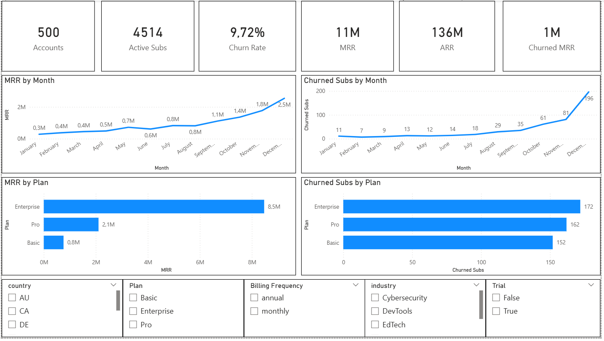
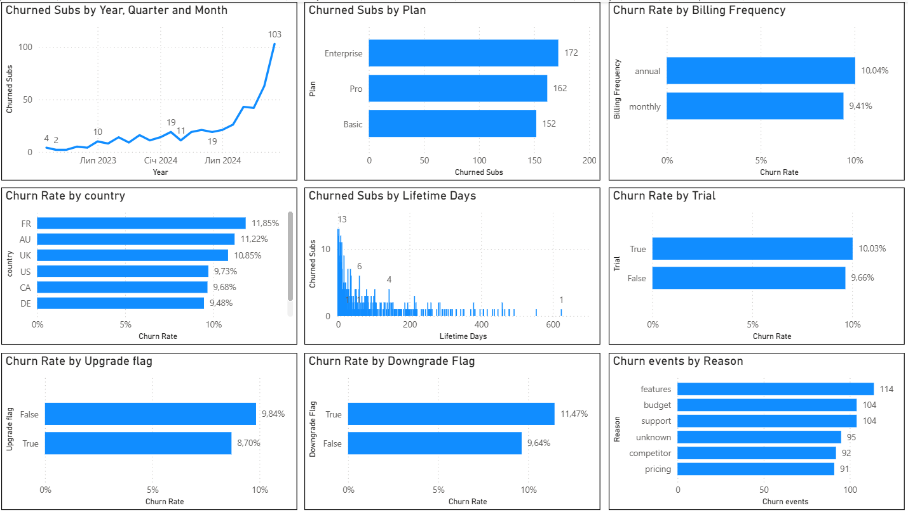
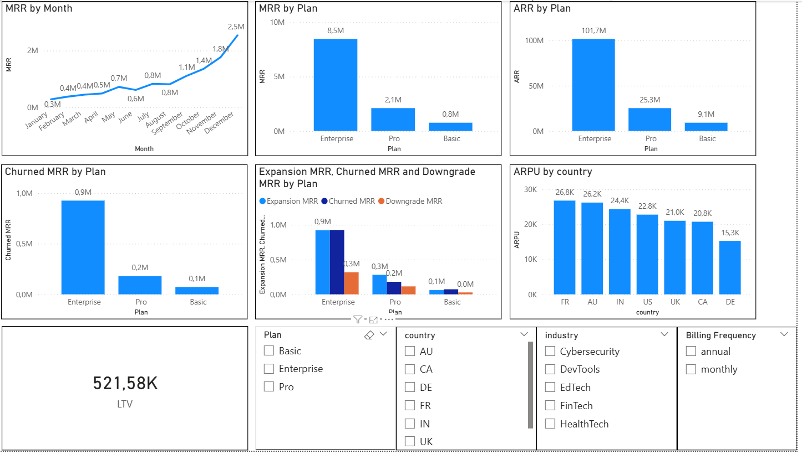
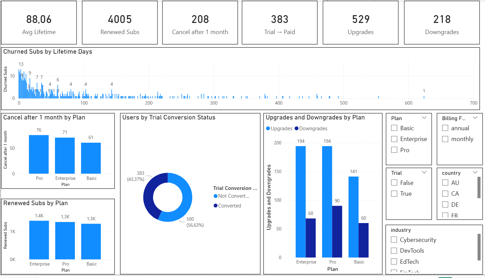
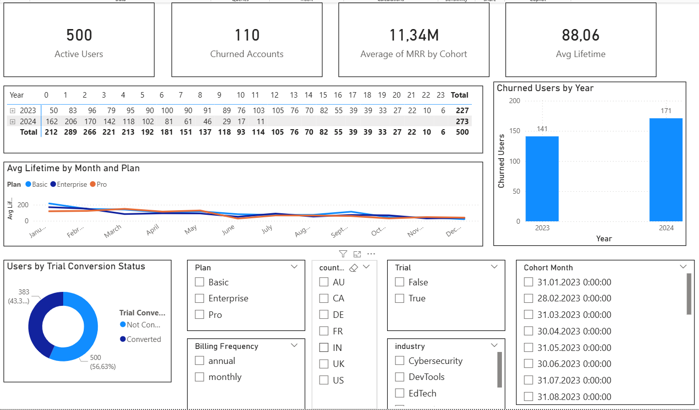
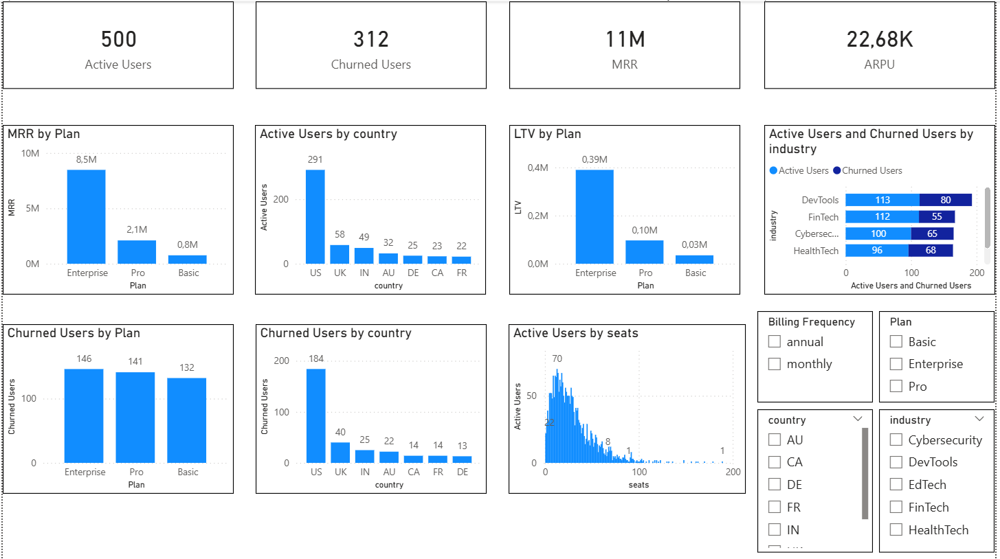
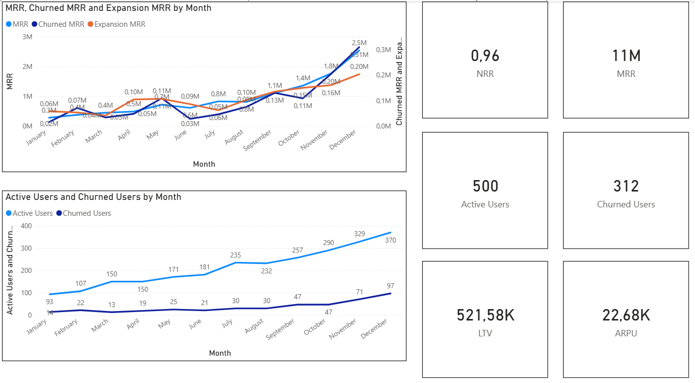
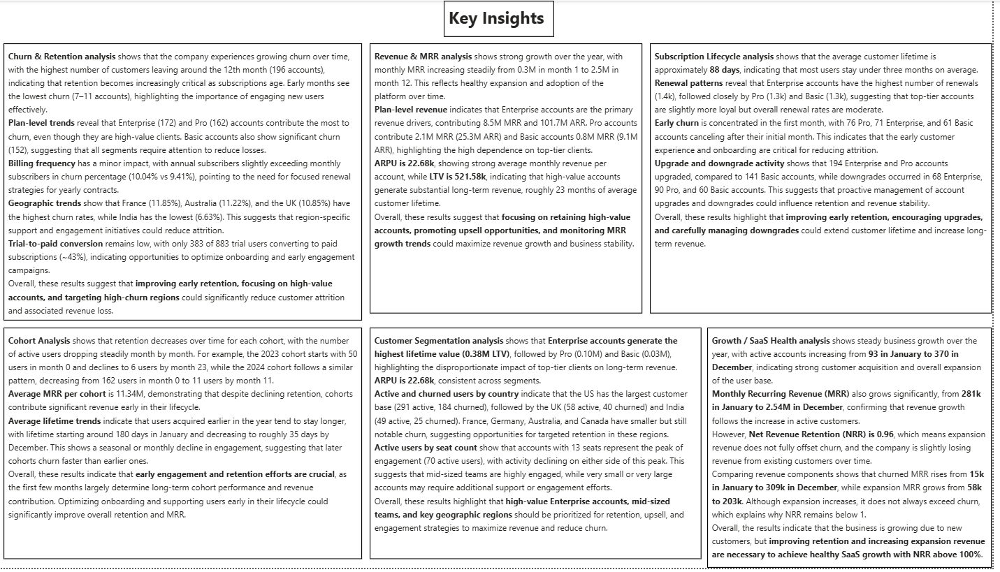
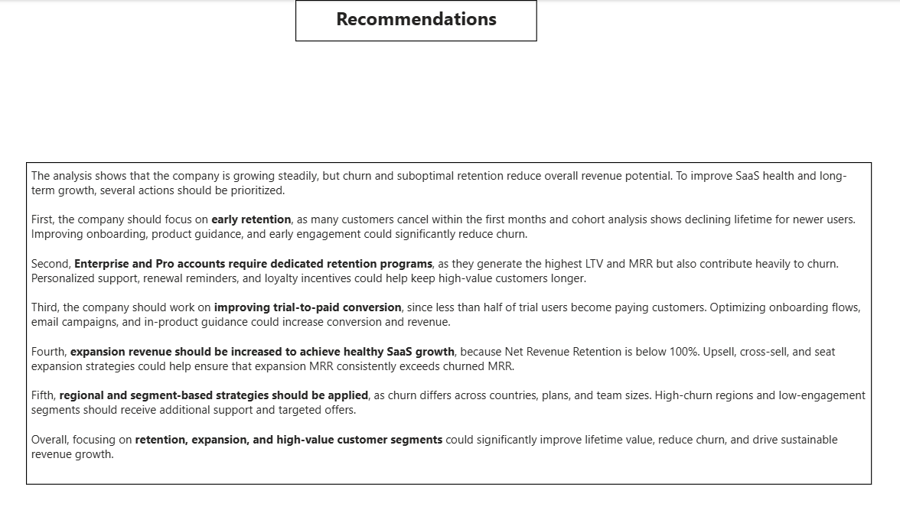

# SaaS Subscription Analytics Dashboard (Power BI)

This project is an end-to-end SaaS analytics dashboard built using SQL, BigQuery, and Power BI.  
The goal of the project is to analyze subscription data, identify churn drivers, evaluate revenue growth, and measure overall SaaS business health.

---

## Project Goals

The main objectives of this analysis were:

- Understand why customers churn
- Analyze revenue growth and MRR trends
- Measure customer lifetime value (LTV)
- Evaluate subscription lifecycle behavior
- Perform cohort analysis
- Identify high-value customer segments
- Check overall SaaS business health using NRR and growth metrics

---

## Key Findings

- Churn increases over time, with the highest number of cancellations around the 12th month.
- Enterprise and Pro plans generate most revenue but also contribute significantly to churn.
- Trial-to-paid conversion is low (~43%), indicating onboarding issues.
- MRR grows strongly during the year, driven mainly by Enterprise accounts.
- Average customer lifetime decreases for newer cohorts.
- Enterprise accounts have the highest LTV, while Basic accounts generate the lowest.
- Net Revenue Retention is below 100%, meaning churn is not fully offset by expansion.
- Active accounts grow during the year, but churn also increases.

---

## Recommendations

- Improve early retention with better onboarding and customer guidance.
- Focus on retaining high-value Enterprise and Pro accounts.
- Increase trial-to-paid conversion through engagement campaigns.
- Implement renewal and loyalty programs for annual subscriptions.
- Increase expansion revenue through upsell and seat growth.
- Apply region-specific strategies for high-churn countries.
- Monitor NRR and ensure expansion exceeds churn.

---

## Dataset

SaaS Subscription dataset

Tables used:

- accounts
- subscriptions
- churn_events
- feature_usage
- support_tickets

Data was prepared in BigQuery and imported into Power BI.

---

## Tools

- Power BI
- SQL
- BigQuery
- DAX
- GitHub

---

## Dashboard Pages

1. Churn & Retention
2. Revenue & MRR
3. Subscription Lifecycle
4. Cohort Analysis
5. Customer Segmentation
6. Growth / SaaS Health
7. Key Insights & Recommendations

---

## Key Metrics

- Churn Rate
- MRR / ARR
- ARPU
- LTV
- Net Revenue Retention
- Trial Conversion Rate
- Cohort Retention

---

## Dashboard Preview

---

## Author
Martyn Kovalchuk

Portfolio project for Data / Product Analyst position
